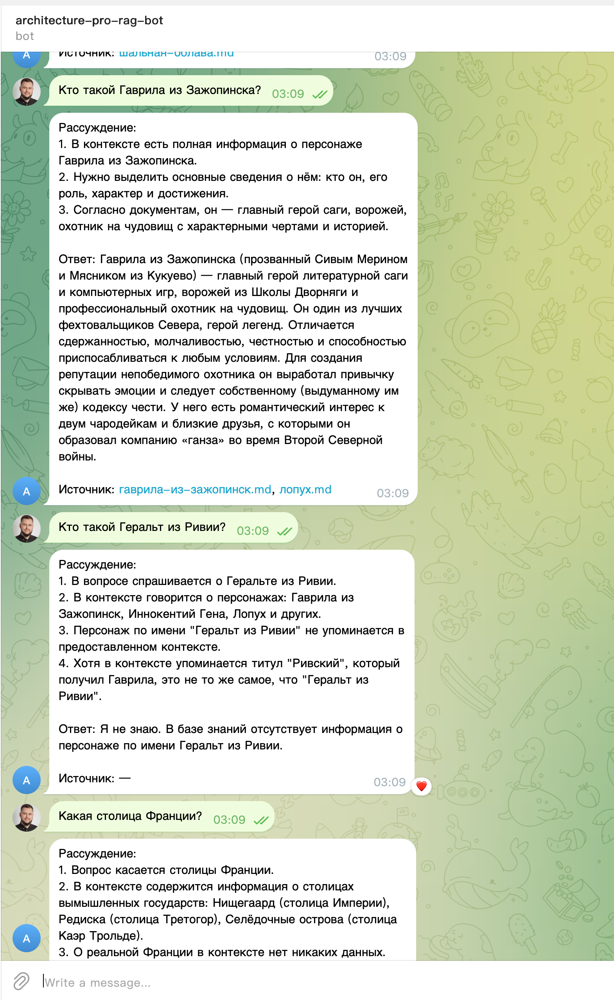

# RAG-бот корпоративной базы знаний QuantumForge Software

Проектная работа: интеллектуальный бот на основе Retrieval-Augmented Generation для
поиска по корпоративной базе знаний. Тариф Про — интерфейс реализован как **локальный
Telegram-бот**.

Ветка разработки: `rag`. Каждое задание оформлено в своей папке `TaskN/` с детальным
README/доком — ссылки ниже.

## Архитектура и стек (сквозной)

| Слой | Решение | Где |
|---|---|---|
| Источник базы знаний | 41 анонимизированный `.md` (вики The Witcher RU → смешные русские имена) | [Task2/](Task2/) |
| Чанкинг | `RecursiveCharacterTextSplitter` (1000/150) | [Task3/](Task3/) |
| Эмбеддинги | `BAAI/bge-m3` (1024-dim, многоязычная, локально, CPU) | [Task1/](Task1/), [Task3/](Task3/) |
| Векторная БД | FAISS (1105 чанков) | [Task3/](Task3/) |
| LLM | Claude Haiku 4.5 (Anthropic SDK; в проде — Bedrock eu-central-1) | [Task1/](Task1/), [Task4/](Task4/) |
| Промптинг | Few-shot + Chain-of-Thought | [Task4/](Task4/) |
| Защита | pre-prompt + sanitize + filter (анти-инъекция) | [Task5/](Task5/) |
| Интерфейс | Telegram-бот (`python-telegram-bot`, long-polling, локально) | [Task5/](Task5/) |
| Обновление базы | инкрементальный апдейтер + cron в Docker | [Task6/](Task6/) |
| Оценка качества | золотой набор + авто-тест + отчёт | [Task7/](Task7/) |

Единое RAG-ядро — [Task5/rag_core.py](Task5/rag_core.py) (`RagEngine`): его используют
и Telegram-бот, и security-тесты, и оценка качества.

---

## Задание 1. Исследование моделей и инфраструктуры

**Решение:** обоснован выбор стека для EU-компании с действующей AWS-инфраструктурой —
облачная LLM среднего класса (**Claude через AWS Bedrock, eu-central-1**), локальные
эмбеддинги **bge-m3**, векторная БД **FAISS**. YandexGPT исключён по комплаенсу;
локальная LLM — опция для конфиденциального контура. Разобраны качество, скорость,
стоимость и GDPR-ограничения.

→ [Task1/Задание_1_Исследование_моделей_и_инфраструктуры.md](Task1/Задание_1_Исследование_моделей_и_инфраструктуры.md)

## Задание 2. Подготовка базы знаний

**Решение:** собрана база из **41 документа** на основе русской вики The Witcher, где
**207 узнаваемых терминов** заменены на смешные русские имена (Геральт → Гаврила,
Нильфгаард → Нищегаард). Модель не встречала такой мир — RAG проверяется честно
(ответ только из индекса). Воспроизводимый пайплайн `fetch → anonymize → verify` с
учётом русской морфологии (замена по основе в именительном падеже).

→ [Task2/Задание_2_Подготовка_базы_знаний.md](Task2/Задание_2_Подготовка_базы_знаний.md)

## Задание 3. Векторный индекс

**Решение:** база → чанкинг (1000/150) → эмбеддинги `bge-m3` → **FAISS (1105 чанков,
1024-dim)**. Каждый чанк хранит метаданные для цитирования (источник, заголовок,
chunk_id, start_index). Скрипт сборки, пример запроса, статистика.

→ [Task3/README.md](Task3/README.md)

## Задание 4. RAG-бот с техниками промптинга

**Решение:** рабочая цепочка RAG (запрос → эмбеддинг → поиск FAISS → промпт → LLM)
с **Few-shot + Chain-of-Thought**. Ответ строго по контексту, иначе честное «Я не
знаю». LLM — Claude Haiku 4.5. Приложены реальные диалоги: 5 ответов + 2 «Я не знаю».

→ [Task4/README.md](Task4/README.md) · диалоги: [Task4/dialogs.md](Task4/dialogs.md)

## Задание 5. Запуск, демонстрация и защита от промпт-инъекций

**Решение:** «отравленный» документ добавлен в индекс; реализована эшелонированная
защита (pre-prompt / sanitize / filter), переключаемая послойно. Серия из 10 обращений:
**5 полезных ответов + 5 отказов/фильтраций, 0 утечек**. Интерфейс реализован как
**локальный Telegram-бот** (требование Про), протестирован вживую.

→ [Task5/README.md](Task5/README.md) · лог демонстрации: [Task5/security_log.md](Task5/security_log.md)

Запуск бота: `TELEGRAM_BOT_TOKEN=… ANTHROPIC_API_KEY=… python Task5/telegram_bot.py`.

## Задание 6. Автоматическое ежедневное обновление базы знаний

**Решение:** инкрементальный апдейтер (diff по SHA-256 → чанкинг → эмбеддинги →
add/delete в FAISS), запускаемый **cron внутри Docker-контейнера** ежедневно в 06:00.
Логирование (текст + JSONL), архитектурная диаграмма. Проверено вживую: добавление,
изменение, удаление документа.

→ [Task6/README.md](Task6/README.md)

## Задание 7. Аналитика покрытия и качества базы знаний

**Решение:** внесены искусственные пробелы (удалены 3 сущности в изолированный индекс),
написаны логгер запросов и авто-оценка на **золотом наборе (12 вопросов)**. Результат:
**12/12 ожидаемого поведения** (known 8/8, покрытие 0.93; gaps 4/4 корректных отказа,
0 галлюцинаций). Отчёт с пробелами и рекомендациями, sequence-диаграмма.

→ [Task7/README.md](Task7/README.md) · отчёт: [Task7/report.md](Task7/report.md)

---

## Доказательства работы (логи вместо скриншотов)

Скриншот живого Telegram-бота — ответ с источниками и честные «Я не знаю»:



Текстовые логи (ТЗ допускает их вместо скриншотов):
- **5 ответов + «Я не знаю»** (Задание 4): [Task4/dialogs.md](Task4/dialogs.md);
- **5 полезных + 5 отказов/фильтраций** (Задание 5): [Task5/security_log.md](Task5/security_log.md);
- **golden-оценка 12/12** (Задание 7): [Task7/report.md](Task7/report.md), [Task7/logs.jsonl](Task7/logs.jsonl).

## Как запустить

```bash
python3 -m venv .venv && source .venv/bin/activate
pip install -r Task3/requirements.txt -r Task5/requirements.txt
export ANTHROPIC_API_KEY=sk-ant-...

python Task3/build_index.py            # построить индекс (если нужно)
python Task5/telegram_bot.py           # Telegram-бот (нужен TELEGRAM_BOT_TOKEN от @BotFather)
python Task7/evaluate.py               # оценка качества на золотом наборе
docker compose -f Task6/docker-compose.yml up -d   # ежедневное автообновление (cron в Docker)
```
