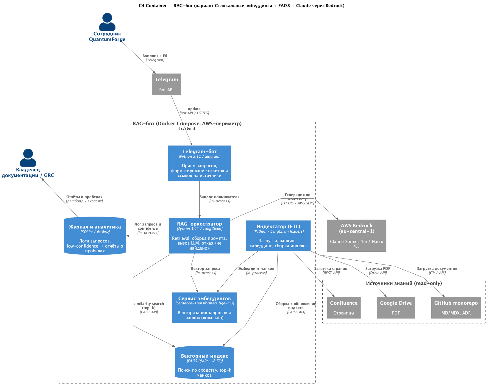

# Задание 1. Исследование моделей и инфраструктуры

## 0. Контекст и ограничения

Контекст определяет допустимые варианты стека и заказчика решения.

- **Заказчик:** руководство QuantumForge Software (CTO / R&D-директор). Бизнес-цели: снижение FTE-затрат на поиск, ускорение онбординга, разгрузка тимлидов и саппорта, выявление пробелов в документации, подготовка к SOC 2.
- **Пользователи:** разработчики (архитектура, API, микросервисы), саппорт (типовые проблемы), менеджеры/аналитики (регламенты, бизнес-правила), новые сотрудники (онбординг).

**Ограничения, влияющие на выбор стека:**

| Ограничение | Следствие для выбора |
|---|---|
| Компания из ЕС (Хельсинки, Таллин); клиенты ABB, Wärtsilä, скандинавские энергокомпании | GDPR и резидентность данных в ЕС. Конфиденциальные спецификации SCADA-проектов не допускают бесконтрольной передачи во внешние облака. |
| Существующая инфраструктура AWS (EKS + RDS), Terraform, ArgoCD | Облачные компоненты разворачиваются внутри AWS-периметра компании: без нового вендора, в едином биллинге и контуре комплаенса. |
| Объём: ~18 000 MD/MDX + ~3 000 страниц Confluence + ~250 PDF; прирост ~400 страниц/мес | Объём базы знаний — средний. Требование к распределённым векторным БД отсутствует. |
| Конфиденциальность спецификаций | Требуется опция обработки чувствительных данных без выноса в облако (локальные эмбеддинги и/или локальная LLM для части контента). |

**Критерий выбора:** баланс «качество — стоимость — комплаенс — простота эксплуатации» для EU-компании с действующей AWS-инфраструктурой.

---

## 1. LLM-модели: локальные (Hugging Face) vs облачные (OpenAI / YandexGPT / Claude)

**Вывод:** для целевого объёма оптимальна облачная модель среднего класса, развёрнутая в AWS-периметре компании — **Claude Sonnet 4.6 / Haiku 4.5 через AWS Bedrock (eu-central-1)**. YandexGPT исключается по комплаенсу. Локальная LLM обоснована только для конфиденциального контура.

> В задании названы OpenAI и YandexGPT. Anthropic Claude включён дополнительно: он доступен через AWS Bedrock в EU-регионе (Frankfurt, eu-central-1), разворачивается в существующем AWS-периметре компании, данные остаются в ЕС и не используются для обучения. Это минимизирует число новых вендоров и периметров комплаенса.

### 1.1. Качество ответов

| Класс модели | Примеры | Качество для RAG |
|---|---|---|
| Облачные топ-модели | GPT-5 / GPT-5.5, Claude Opus 4.8 / Sonnet 4.6 | Эталон: следование инструкциям, длинный контекст (до 1M токенов у Claude 4.x), корректный отказ «не найдено», работа с технической документацией и кодом. |
| Облачные «mini» | GPT-5 Mini, Claude Haiku 4.5, YandexGPT 5 Pro | Достаточны для большинства RAG-ответов, где контекст уже найден ретривером. Существенно дешевле. |
| Локальные (open-weight) | Llama 4 Scout/Maverick (MoE), Qwen3 / Qwen3.5 (72B/32B, MoE 235B-A22B), DeepSeek V3.2, Gemma 3 27B, Mistral Small 4; компактные — Qwen3 7–14B, Gemma 3 12B, Phi-4 14B | Старшие модели (70B-класс / MoE) сопоставимы с облачными «mini» на grounded-задачах. Компактные 7–14B приемлемы для FAQ/онбординга, слабее на сложных архитектурных вопросах и при отказах. |
| YandexGPT | YandexGPT 5 Pro / Lite | Преимущество на русском языке. Документация QuantumForge преимущественно англоязычная (MD/ADR/Confluence) — преимущество не востребовано. |

В RAG-сценарии разрыв в качестве между топ-облаком и локальной 70B-моделью сокращается: основную работу выполняет ретривер, от модели требуется корректный пересказ найденных чанков и отказ при отсутствии данных. Это делает локальную модель технически реалистичной.

### 1.2. Скорость работы

- **Облако:** низкая стабильная задержка, стриминг. «Mini»-модели быстрее топовых.
- **Локально:** задержка определяется GPU. На 1×H100/A100 квантизованная 70B обеспечивает интерактивную скорость; на слабом GPU — деградация. Модели 7–14B быстры на L4/A10G.
- **YandexGPT:** низкая задержка для РФ; для пользователей из ЕС добавляется сетевая латентность до Yandex Cloud.

### 1.3. Стоимость владения и использования

Профиль расчёта: RAG-запрос ≈ **5 000 входных + 500 выходных токенов**; нагрузка ≈ **11 000 запросов/мес** (~500 в рабочий день).

| Модель | Цена вход / выход за 1M токенов | Стоимость запроса | ~11 000 запросов/мес |
|---|---|---|---|
| GPT-5 Mini | $0.25 / $2.00 | ~$0.0023 | ~$25 |
| Claude Haiku 4.5 | $1.00 / $5.00 | ~$0.0075 | ~$83 |
| GPT-5 | $1.25 / $10.00 | ~$0.0113 | ~$124 |
| Claude Sonnet 4.6 | $3.00 / $15.00 | ~$0.0225 | ~$248 |
| Claude Opus 4.8 | $5.00 / $25.00 | ~$0.0375 | ~$413 |
| YandexGPT 5 Pro | ~0.40 ₽ / 1000 ток. | ~2.2 ₽ ≈ $0.025 | ~24 000 ₽ ≈ $270 |

Кэширование промптов (повторяющийся системный промпт и контекст, ~×0.1) дополнительно снижает суммы. Значения — порядок величины, не точный бюджет.

Локальная модель имеет иную структуру затрат (CapEx/OpEx вместо оплаты за токены):

| Сценарий | Железо | Стоимость |
|---|---|---|
| Локальная 70B (24/7) | 1–2× серверных GPU NVIDIA H100 или A100 (80 ГБ видеопамяти каждая), аренда в облаке | ~$1 500–3 000/мес аренды или ~$30 000+ за единицу при покупке |
| Локальная 7–14B (24/7) | 1× GPU NVIDIA L4 или A10G (24 ГБ видеопамяти) | ~$300–600/мес аренды |

**Trade-off:** при объёме ~11 000 запросов/мес облачные модели среднего класса (десятки–сотни долларов/мес) дешевле постоянного GPU. Локальная LLM окупается при больших объёмах либо при требовании локального инференса по комплаенсу.

### 1.4. Простота развёртывания и эксплуатации

| Критерий | Облако (OpenAI / Claude / Yandex) | Локально (HF) |
|---|---|---|
| Развёртывание | API-ключ, SDK — часы | vLLM/TGI, GPU-драйверы, квантизация, мониторинг — дни/недели |
| Эксплуатация | SLA, апдейты и масштабирование на стороне провайдера | На стороне DevOps: апгрейды, OOM, автоскейл GPU |
| Масштабирование | Эластичное | Докупка/аренда GPU |

### 1.5. Выводы по LLM

- **Минимальная стоимость и сложность старта:** облачная модель среднего класса.
- **Целевой выбор (EU + AWS):** Claude Sonnet 4.6 (основная нагрузка) и Haiku 4.5 (простые запросы) через AWS Bedrock (eu-central-1). Данные остаются в ЕС и в AWS-аккаунте компании, не используются для обучения; единый биллинг и комплаенс.
- **Альтернатива:** OpenAI с EU data-residency / zero-retention.
- **Исключение:** YandexGPT — передача конфиденциальных данных клиентов в российское облако недопустима по GDPR, резидентности и требованиям доверия заказчиков.
- **Локальная HF-модель:** обоснована только для конфиденциального контура (раздел 5).

---

## 2. Модели эмбеддингов: локальные (Sentence-Transformers) vs облачные (OpenAI Embeddings)

**Вывод:** рекомендуются локальные Sentence-Transformers (`bge-m3` или `multilingual-e5-large`). Критерий выбора — конфиденциальность и контроль, а не стоимость.

### 2.1. Стоимость индексации не является фактором выбора

База знаний — ~21 000 документов, ~50–100 млн токенов.

| Модель | Цена | Стоимость полной индексации |
|---|---|---|
| OpenAI `text-embedding-3-small` | $0.02 / 1M токенов | ~$1–2 |
| OpenAI `text-embedding-3-large` | ~$0.13 / 1M токенов | ~$7–13 |

Стоимость индексации — единицы долларов; инкрементальное обновление (+400 страниц/мес) — пренебрежимо. Следовательно, выбор определяется конфиденциальностью (при облачных эмбеддингах вся база знаний, включая спецификации, передаётся во внешний API) и независимостью от вендора.

### 2.2. Скорость создания индекса

- **OpenAI Embeddings:** ограничена сетью и rate-limit'ами; для целевого объёма — от десятков минут до нескольких часов.
- **Sentence-Transformers:** на GPU (L4/A10G) — минуты–десятки минут; на CPU приемлемо для разовой/ночной индексации.

### 2.3. Качество поиска

| Модель | Тип | Качество retrieval |
|---|---|---|
| OpenAI `text-embedding-3-large` (3072-dim) | Облако | Один из лучших; многоязычный, стабильный. |
| `BAAI/bge-m3` | Локальная | Топ среди open-source: многоязычный, контекст 8192, dense + sparse + ColBERT (гибридный поиск). |
| `intfloat/multilingual-e5-large` | Локальная | Сильная многоязычная модель, проверена в проде. |
| `sentence-transformers/all-MiniLM-L6-v2` (384-dim) | Локальная | Быстрая и лёгкая, качество ниже; уровень MVP/прототипа. |

Для англоязычной технической базы (с возможными русскими/финскими вкраплениями) `bge-m3` или `multilingual-e5-large` сопоставимы с облачными эмбеддингами.

### 2.4. Стоимость владения

| Тип | Затраты | Контроль данных |
|---|---|---|
| Облачные | Железо — $0; оплата за токены: ~$1–13 за полную индексацию базы знаний (см. 2.1) + единицы центов/мес на инкремент (+400 страниц/мес) | Вся база знаний передаётся во внешний API |
| Локальные | Использование — $0; модель ~2–2.5 ГБ на диске, ~2–4 ГБ RAM при инференсе на CPU; для ускорения разовой индексации опц. 1× GPU NVIDIA L4 / A10G (24 ГБ видеопамяти) | База знаний не покидает периметр |

### 2.5. Выводы по эмбеддингам

- **Выбор:** локальные Sentence-Transformers (`bge-m3` / `multilingual-e5-large`).
- **Обоснование:** облачные эмбеддинги не дают экономии; локальные обеспечивают контроль над конфиденциальными данными, независимость от вендора и быструю индексацию на собственном железе.
- **Альтернатива:** облачные эмбеддинги при приоритете максимального качества без собственной GPU-индексации.

---

## 3. Векторная БД: ChromaDB vs FAISS

**Вывод:** FAISS на этапе MVP и первого прод-релиза; миграция на ChromaDB при появлении требований к метаданным и частым обновлениям.

> FAISS (Facebook AI Similarity Search) — библиотека для поиска по векторам. ChromaDB — встраиваемая векторная БД со встроенным хранилищем, метаданными и API. Уровни абстракции различны — это определяет выбор.

### 3.1. Скорость поиска и индексации

| Критерий | FAISS | ChromaDB |
|---|---|---|
| Скорость поиска | Выше (IVF/HNSW/PQ, опц. GPU ×5–10); до миллиардов векторов | Хорошая (HNSW); стабильна для малых/средних коллекций |
| Индексация | Очень быстрая, гибкие типы индексов | Удобная, без тонкой настройки индексов |
| Масштаб | Миллиарды векторов | Малые/средние коллекции |

Для целевого объёма (сотни тысяч чанков) обе БД обеспечивают требуемую производительность с запасом; разница в сырой скорости не является практическим ограничением.

### 3.2. Сложность внедрения и поддержки

| Критерий | FAISS | ChromaDB |
|---|---|---|
| Из коробки | Только векторный поиск; персистентность, хранение текста/метаданных, API, CRUD — реализуются самостоятельно | Полноценная БД: хранение, метаданные, фильтрация, персистентность, CRUD |
| Порог входа | Больше обвязки, прямой контроль | Минимум кода |
| Интеграция с LangChain | Первоклассная (`langchain_community.vectorstores.FAISS`) | Первоклассная (`Chroma`) |

### 3.3. Удобство в работе

- **FAISS:** лёгкий встраиваемый индекс без отдельного сервиса; индекс сохраняется в файл и размещается в одном контейнере с ботом. Подходит для MVP и упаковки «бот + индекс».
- **ChromaDB:** метаданные, фильтрация, частые обновления и «БД-шный» опыт без собственной обвязки.

### 3.4. Стоимость владения (с учётом инфраструктуры)

| Критерий | FAISS | ChromaDB |
|---|---|---|
| Лицензия | Open-source | Open-source |
| Инфраструктура | В процессе бота, отдельный сервис не нужен; индекс ~500k векторов (1024-dim, float32) ≈ 2 ГБ RAM | Embedded или отдельный сервис (больше инфраструктуры в проде) |
| Эксплуатация | Администрируется только файл индекса | Уровень полноценной БД (особенно в client/server-режиме) |

### 3.5. Выводы по векторной БД

- **FAISS:** минимум инфраструктуры, высокая скорость, встраивание в контейнер, open-source, поддержка в LangChain. Trade-off — самостоятельная реализация хранения метаданных и обновления документов.
- **ChromaDB:** встроенные метаданные, фильтры, CRUD, персистентность, лучший DX. Trade-off — больше инфраструктуры в проде.
- **Решение:** старт на FAISS; миграция на ChromaDB/managed при появлении явных потребностей (богатые метаданные, частые точечные обновления, мультитенантность). Детализация — раздел 6.

---

## 4. Конфигурация сервера (CPU / RAM / GPU)

**Вывод:** для целевой архитектуры (облачная LLM + локальные эмбеддинги + FAISS) GPU в продакшене не требуется; разовая индексация выполняется на spot-GPU.

### 4.1. Базовый сервинг (рекомендуемый)

- **CPU:** 8 vCPU
- **RAM:** 32 GB (FAISS-индекс ≈ 2 ГБ; модель эмбеддингов, приложение, запас)
- **GPU:** не обязателен (FAISS-CPU и инференс эмбеддингов на CPU при умеренной нагрузке). При требовании низкой задержки эмбеддингов — 1× NVIDIA L4 (24 GB)
- **Диск:** 100 GB SSD
- **Размещение:** инстанс в AWS компании (например, `m6i.2xlarge`); LLM — Claude через Bedrock (eu-central-1)

### 4.2. Разовая/пакетная индексация

- Spot-GPU (например, AWS `g5.xlarge`, A10G 24 GB) на время билда индекса; сервинг — на CPU. Дешевле постоянного GPU.

### 4.3. Полностью локальный контур (своя LLM)

| Класс модели | Конфигурация |
|---|---|
| Малая (Qwen3 7–14B / Gemma 3 12B / Phi-4 14B) | 16 vCPU, 64 GB RAM, 1× GPU NVIDIA L4 или A10G (24 ГБ видеопамяти) |
| Крупная (70B-класс / MoE, квантизованная) | 16+ vCPU, 128 GB RAM, 1–2× серверных GPU NVIDIA A100 или H100 (80 ГБ видеопамяти) — существенный CapEx/OpEx |

---

## 5. Варианты конфигурации: сравнение и выбор

**Вывод:** выбран **вариант C (гибрид)** с планом эволюции к варианту D.

| Критерий | A. Полностью облако | B. Полностью локально | C. Гибрид (выбран) | D. Гибрид с классификацией данных |
|---|---|---|---|---|
| LLM | OpenAI/Claude API | Локальная 70B (HF) | Claude/GPT через Bedrock EU | Локальная LLM для конфид. + облако для остального |
| Эмбеддинги | OpenAI Embeddings | Sentence-Transformers | Sentence-Transformers (локально) | Локальные |
| Векторная БД | FAISS / managed | FAISS | FAISS → Chroma | FAISS (изоляция индексов) |
| Качество ответов | Максимум | Среднее–хорошее | Высокое | Высокое |
| Конфиденциальность / GDPR | Риск: данные уходят в облако | Соответствует: всё в периметре | Соответствует: база знаний локально, LLM в AWS-EU | Соответствует (макс. контроль) |
| CapEx | Низкий | Высокий (GPU) | Низкий | Высокий |
| OpEx | Низкий–средний (за токены) | Высокий (GPU 24/7) | Низкий | Высокий |
| Простота эксплуатации | Высокая | Низкая (DevOps + GPU) | Высокая | Низкая |
| Time-to-market | Дни | Недели | Дни–недели | Недели–месяцы |
| Соответствие AWS-инфраструктуре | Частичное | Своя инфраструктура | Полное (Bedrock в AWS компании) | Полное |

**Разбор:**

- **A. Полностью облако:** быстрый и качественный старт; конфиденциальные спецификации передаются во внешний API — риск GDPR и доверия заказчиков. Не применим без доработки.
- **B. Полностью локально:** максимальный контроль данных; высокий CapEx (GPU 24/7), сложная эксплуатация, качество LLM ниже топ-облака, медленный выход. Избыточно для текущего объёма.
- **C. Гибрид (выбран):** локальные эмбеддинги и FAISS (база знаний не покидает периметр) + облачная LLM через Bedrock (eu-central-1) (генерация в AWS-аккаунте компании, данные в ЕС, без обучения). Сочетает качество облачной модели, контроль данных, низкий OpEx и простоту.
- **D. Гибрид с классификацией данных:** конфиденциальные документы — локальная LLM, публичные — облако. Максимальная безопасность, но высокий CapEx и сложность. Целевая архитектура следующего этапа, не для MVP.

**Обоснование выбора C:**

1. **Комплаенс:** база знаний индексируется локально и не выходит за периметр; инференс — в AWS-периметре компании в ЕС (Bedrock), без использования данных для обучения.
2. **Соответствие инфраструктуре:** компания на AWS — Bedrock не добавляет вендора, биллинга и периметра комплаенса.
3. **OpEx:** при ~11 000 запросов/мес — десятки–сотни долларов/мес, без CapEx на GPU.
4. **Time-to-market:** локальные эмбеддинги + FAISS + LangChain + Docker Compose разворачиваются за дни.
5. **Эволюционируемость:** переход к варианту D и к ChromaDB/managed-БД без слома архитектуры.

---

## 6. Заключение: выбор векторной БД

**Вывод:** **FAISS** на этапе MVP и первого прод-релиза; миграция на **ChromaDB** по мере роста требований.

**Обоснование (FAISS):**

1. **Минимум инфраструктуры и стоимости владения.** Индекс работает в процессе бота, отдельный сервис не нужен; индекс на сотни тысяч векторов ≈ 2 ГБ RAM, хранится одним файлом. Соответствует требованию задания «бот + FAISS в Docker».
2. **Производительность с запасом.** Для целевого объёма (сотни тысяч чанков) скорость и опциональное GPU-ускорение обеспечивают запас при росте (+400 страниц/мес).
3. **Open-source и зрелость.** Интеграция с LangChain (`langchain_community.vectorstores.FAISS`), проверено в проде.
4. **Простота эксплуатации.** Администрируется только файл индекса; переиндексация и версионирование тривиальны.
5. **Соответствие гибридной архитектуре (вариант C).** Локальный встраиваемый индекс не выносит данные за периметр.

**Trade-off и условие миграции на ChromaDB:** FAISS требует самостоятельной реализации хранения метаданных и обновления документов. Переход на ChromaDB оправдан при потребности в фильтрации по метаданным (владелец, пространство Confluence, дата, версия — необходимо для задач «выявление устаревшего» и подготовки к SOC 2), частых точечных обновлениях/удалениях или «БД-шном» опыте. Абстракция LangChain VectorStore позволяет выполнить миграцию без переписывания логики бота.

**Итоговый стек:**

- **Векторная БД:** FAISS (MVP/прод-старт) → ChromaDB при росте требований к метаданным.
- **Эмбеддинги:** локальные Sentence-Transformers (`bge-m3` / `multilingual-e5-large`).
- **LLM:** Claude Sonnet 4.6 / Haiku 4.5 через AWS Bedrock (eu-central-1); альтернатива — OpenAI с EU-резидентностью.
- **Инфраструктура:** сервинг 8 vCPU / 32 GB RAM (опц. L4 GPU); разовая индексация на spot-GPU; размещение в AWS-периметре компании.

---

## 7. Целевая архитектура (C4 Container)

Итоговая архитектура (вариант C) с выбранной векторной БД FAISS: онлайн-путь запроса (Telegram → оркестратор → FAISS → Bedrock) и офлайн-путь индексации (ETL из источников знаний). Эмбеддинги, векторный индекс и журнал — внутри AWS-периметра компании; наружу уходит только запрос на генерацию в Bedrock (eu-central-1).

