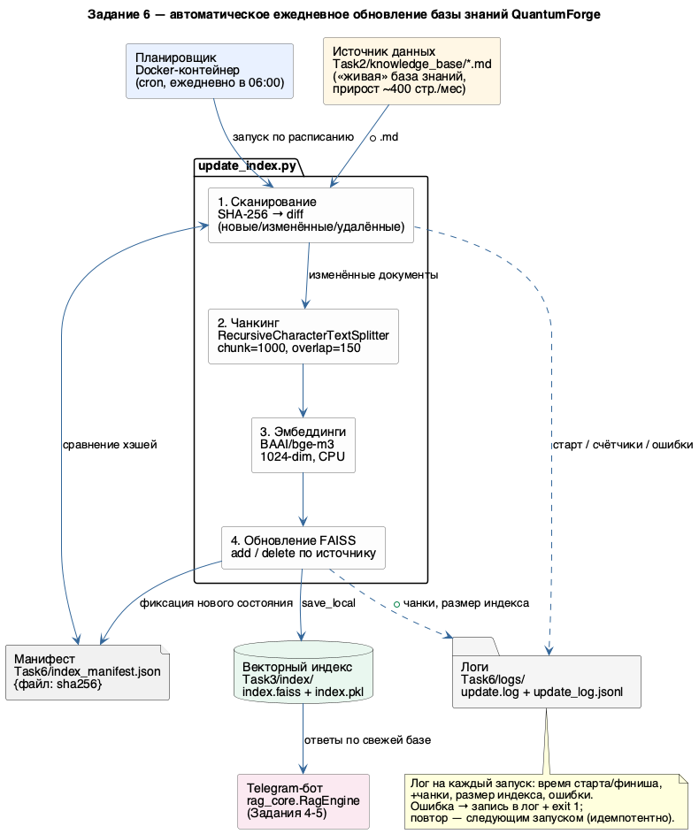

# Задание 6. Автоматическое ежедневное обновление базы знаний

## Вывод

Процесс обновления индекса полностью автоматизирован скриптом
[update_index.py](update_index.py): он инкрементально (по SHA-256) находит новые,
изменённые и удалённые документы, переиндексирует только их и обновляет тот же
индекс `Task3/index/`, который читает Telegram-бот. Периодический запуск — **cron
внутри Docker-контейнера** ежедневно в 06:00. Каждый запуск логируется
(человекочитаемый лог + JSONL). Проверено вживую: добавление, изменение и удаление
документа.

## Источник данных и механизм «подхвата»

**Источник:** локальная папка [Task2/knowledge_base/](../Task2/knowledge_base/) —
«живая» база знаний компании, которая прирастает (~400 страниц/месяц по брифу).

**Подхват нового файла:** скрипт хранит манифест
[index_manifest.json](index_manifest.json) — отображение `{имя файла: sha256}` на
момент прошлого запуска. На каждом запуске он сканирует папку и сравнивает хэши:
- файла нет в манифесте → **новый** → индексируется;
- хэш отличается → **изменённый** → старые чанки удаляются, документ переиндексируется;
- файл в манифесте, но отсутствует на диске → **удалённый** → его чанки удаляются.

Хэш (а не mtime) устойчив к `git checkout` и копированию. Источник заменяется на
S3/Git/RSS/Google Drive правкой одной функции `scan_source()` — остальной пайплайн
не меняется.

## Скрипт обновления

`update_index.py` выполняет шаги:
1. **Сканирование** источника, расчёт SHA-256, diff с манифестом.
2. **Чанкинг** изменённых документов — `RecursiveCharacterTextSplitter`
   (chunk=1000, overlap=150), как в Задании 3.
3. **Эмбеддинги** — `BAAI/bge-m3` (1024-dim, CPU), тот же энкодер, что в индексе.
4. **Обновление FAISS** — `delete()` чанков устаревших файлов по источнику +
   `add_documents()` новых; `save_local()` только при наличии изменений.
5. **Логирование** и обновление манифеста.

Первый запуск без манифеста безопасен: манифест инициализируется из источников,
уже присутствующих в индексе, поэтому документы не дублируются.

## Запуск

### Вручную
```bash
source Task3/.venv/bin/activate
python Task6/update_index.py
```

### По расписанию — Docker (cron в контейнере)
Внутри образа работает системный `cron` и ежедневно в 06:00 запускает
`update_index.py`. База, индекс, логи и манифест монтируются с хоста, поэтому
контейнер обновляет тот же `Task3/index/`, который читает бот. Модель `bge-m3`
кэшируется в именованном volume.
```bash
docker compose -f Task6/docker-compose.yml build
docker compose -f Task6/docker-compose.yml up -d                      # запустить cron
docker compose -f Task6/docker-compose.yml run --rm updater \
    python Task6/update_index.py                                       # разовый прогон (тест)
docker compose -f Task6/docker-compose.yml logs -f                    # наблюдать
docker compose -f Task6/docker-compose.yml down                       # остановить
```
Апдейтеру **не нужен** `ANTHROPIC_API_KEY` — он использует только эмбеддинги, не LLM.
Расписание задаётся в [Task6/crontab](crontab) (`0 6 * * *`).

**Частота:** ежедневно в 06:00 (до начала рабочего дня). Меняется в
[Task6/crontab](crontab) (поле расписания). Для проверки без ожидания можно
временно поставить `* * * * *` и пересобрать образ.

**Поведение при ошибке:**
- ошибки на уровне файла не прерывают весь прогон — собираются в список `errors`;
- критическая ошибка логируется (`exception`), запуск завершается кодом `1`;
- расписание перезапустит задачу в следующий цикл; благодаря манифесту повтор
  **идемпотентен** (заново обрабатываются только незавершённые изменения);
- от параллельных запусков защищает lock-файл `Task6/.update.lock`
  (устаревший >1 ч перехватывается).

## Логирование

Три приёмника, формат — время старта/финиша, счётчики, размер индекса, ошибки:

| Назначение | Файл | Формат |
|---|---|---|
| Человекочитаемый | `Task6/logs/update.log` | текст с таймстампами |
| Машинный | `Task6/logs/update_log.jsonl` | по JSON-объекту на запуск |
| stdout (Docker cron) | `Task6/logs/cron.log` | дублирует текст |

Поля JSONL: `started_at`, `finished_at`, `duration_seconds`, `files_added`,
`files_changed`, `files_removed`, `new_chunks`, `removed_chunks`, `index_size`,
`errors`. Пример — [sample_log.txt](sample_log.txt). Строка в формате ТЗ:

```
index updated at 2026-06-15, 1 files added, 0 errors
```

Живые логи в репозиторий не коммитятся (`.gitignore`).

## Архитектурная диаграмма

[diagrams/architecture.puml](diagrams/architecture.puml) → [diagrams/architecture.png](diagrams/architecture.png)
(источник → скрипт → чанки → эмбеддинги → индекс; манифест; логи; планировщик):



## Проверка работоспособности

Прогон на тестовом документе `тестовый-зверь.md` (см. [sample_log.txt](sample_log.txt)):

| Действие | Детектировано | Индекс | Чанки |
|---|---|---|---|
| Добавление файла | новых=1 | 1105 → **1106** | +1 |
| Изменение файла | изменённых=1 | 1106 | −1 / +1 (по хэшу) |
| Удаление файла | удалённых=1 | 1106 → **1105** | −1 |

После проверки тестовый документ и его чанки удалены, индекс возвращён к исходным
1105 чанкам.

## Trade-offs и альтернативы

- **Инкрементальность по хэшу контента** — надёжно, но требует чтения всех файлов
  целиком. Для тысяч файлов дешевле сверять `mtime`/`ETag` и хэшировать только
  кандидатов. Для текущего объёма (десятки–сотни файлов) хэш проще и точнее.
- **FAISS `delete` + `add`** реиндексирует изменённый файл целиком (а не отдельные
  чанки). Это проще и корректно; для очень крупных документов можно перейти на
  пофрагментный diff.
- **Cron в Docker-контейнере** достаточен для одного хоста и переносим (не зависит
  от host-планировщика). В проде источником расписания станут Kubernetes CronJob или
  Airflow (ретраи, алёртинг, бэкофилл) — образ и логика `update_index.py`
  переиспользуются как есть.
