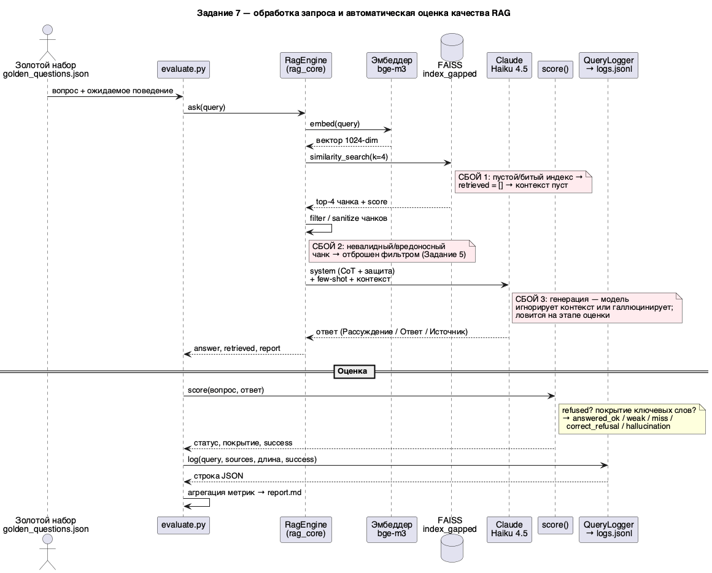

# Задание 7. Аналитика покрытия и качества базы знаний

## Вывод

Построена автоматическая оценка качества RAG-бота на «золотом наборе». В базу
внесены искусственные пробелы (удалены 3 сущности), и тест показал: бот **корректно
отказывается** на всех пробелах (0 галлюцинаций) и **полностью отвечает** на известные
темы (среднее покрытие ключевых слов 0.93). Итог прогона — **12/12 ожидаемого
поведения**. Выявлены 3 «слепых» темы; даны рекомендации по пополнению базы.

Эксперимент изолирован: оценка идёт на `Task7/index_gapped/` (копия прод-индекса
минус удалённые сущности), рабочий `Task3/index/` не затронут.

## Что сделано

1. **Искусственные пробелы** — [build_gapped_index.py](build_gapped_index.py) удаляет
   из копии индекса 3 сущности (`булькало.md`, `шальная-облава.md`, `орлокот.md`)
   через `FAISS.delete` по источнику: 1105 → 1084 чанка.
2. **Логирование запросов** — [query_logger.py](query_logger.py): на каждый запрос
   пишется строка JSON в [logs.jsonl](logs.jsonl).
3. **Золотой набор** — [golden_questions.json](golden_questions.json) (машинный) и
   [golden_questions.txt](golden_questions.txt) (с ожидаемыми ответами): 8 known + 4 gap.
4. **Авто-тестирование** — [evaluate.py](evaluate.py): прогон набора, логирование,
   оценка корректности, агрегация.
5. **Отчёт** — [report.md](report.md) с метриками, плохо покрытыми темами и
   рекомендациями.
6. **Sequence-диаграмма** — [diagrams/sequence.puml](diagrams/sequence.puml).

## Искусственные пробелы

Удалены 3 сущности с дедицированными документами. Важно: косвенные упоминания
(в других доках) остаются — это моделирует реальную ситуацию «дедицированной страницы
нет, но разрозненные упоминания есть», провоцирующую нерелевантные источники.

## Золотой набор (12 вопросов)

| Тип | Кол-во | Ожидаемое поведение |
|---|---|---|
| Known (тема в базе) | 8 | бот отвечает; проверяется покрытие ключевых слов |
| Gap (удалено / отсутствует) | 4 | бот честно отказывается «Я не знаю» |

Gap-вопросы: 3 удалённые сущности + 1 вне базы («Геральт из Ривии» — переименован).

## Логирование запросов

Поля строки [logs.jsonl](logs.jsonl): `timestamp`, `query`, `chunks_found`,
`sources`, `top_score`, `answer_length`, `refused`, `answered`, `topic`,
`should_answer`, `matched_keywords`, `keyword_coverage`, `status`, `success`.

`query_logger.py` переиспользуем: тем же логгером можно оборачивать «живой» бот
(`rag_core.RagEngine.ask`) для аналитики продакшн-трафика.

## Автоматическое тестирование

`evaluate.py` для каждого вопроса вызывает бот, логирует запрос и оценивает:

| Статус | Условие |
|---|---|
| `answered_ok` | known: ответил, покрытие ключевых слов ≥ 0.5 |
| `weak_answer` | known: ответил, но покрытие < 0.5 |
| `coverage_miss` | known: отказался, хотя тема в базе |
| `correct_refusal` | gap: честно отказался |
| `hallucination` | gap: ответил на удалённую/отсутствующую тему |

Метод (по референсам RAG-оценки): детектирование отказа + покрытие «золотых»
ключевых слов как прокси полноты. Детерминированно и воспроизводимо.

## Результаты ([report.md](report.md))

| Метрика | Значение |
|---|---|
| Общая точность | **12/12 = 100%** |
| Known: полный ответ | 8/8 (среднее покрытие 0.93) |
| Gaps: корректный отказ | 4/4 |
| Gaps: галлюцинации | **0** |

## Анализ

- **Плохо покрытые («слепые») темы:** булькало, шальная-облава, орлокот — на них бот
  не даёт ответа (это и есть выявленные пробелы). На known-темах провалов нет.
- **Нерелевантные источники:** на пробелах бот извлекает тангенциальные чанки —
  например, для «булькало» → `зубоскалка.md`, `цыля.md` (top score 0.87); для
  «Шальная Облава» → `болотово.md` (top score 1.08, т.е. далеко). Дедицированного
  источника нет, поэтому ниже близость — но именно такие чанки порождают риск
  «уверенных, но неверных» ответов на слабых моделях. Здесь спасает усиленный
  system-промпт (Задание 5): бот отказывается, а не фантазирует.
- **Где расширять базу:** вернуть удалённые документы; темы с частыми отказами или
  низким `top_score` в `logs.jsonl` — приоритет на пополнение.

## Диаграмма последовательности

[diagrams/sequence.puml](diagrams/sequence.puml) → [diagrams/sequence.png](diagrams/sequence.png):
обработка запроса (эмбеддинг → поиск → фильтр → генерация), процесс оценки и три точки
сбоя (пустой индекс, невалидный чанк, галлюцинация генерации).



## Запуск

```bash
source Task3/.venv/bin/activate
export ANTHROPIC_API_KEY=sk-ant-...
python Task7/build_gapped_index.py     # индекс с пробелами (Task7/index_gapped/)
python Task7/evaluate.py               # прогон → logs.jsonl + report.md
```

## Выводы (для базы знаний компании)

- **Выявлено пробелов:** 3 (удалённые сущности). На реальной базе тем-«пробелов»
  будет больше — их вскрывает регулярный прогон золотого набора.
- **Качество отказов высокое:** бот не галлюцинирует на пробелах — критично для доверия.
- **Рекомендации:** (1) расширять золотой набор под реальные FAQ; (2) прогонять
  `evaluate.py` после каждого обновления индекса (Задание 6) как gate качества;
  (3) анализировать `logs.jsonl` живого бота — отказы и низкий `top_score` указывают,
  какие темы документации требуют пополнения/переписывания.
